# Google サービスアカウントキーの取得方法
- https://console.cloud.google.com/projectselector2/iam-admin/serviceaccounts を開き、`プロジェクトを作成`。
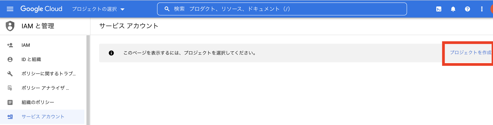
- プロジェクト名を入力し、作成。
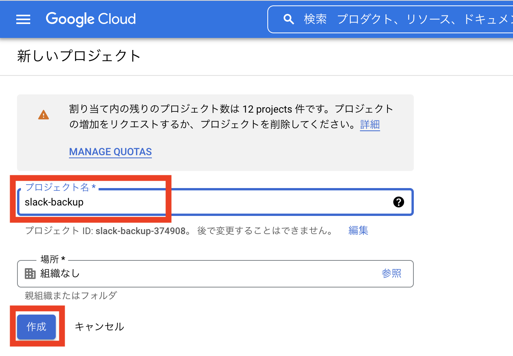
上の検索窓でsheetsと入力し、Google Sheets APIを選択。
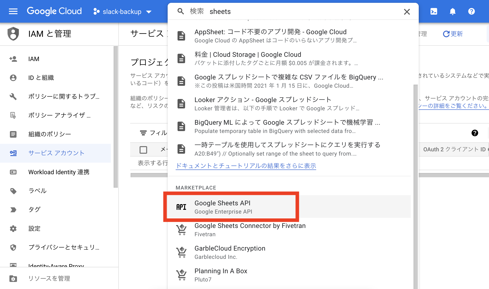
Google Sheets APIを有効にする。
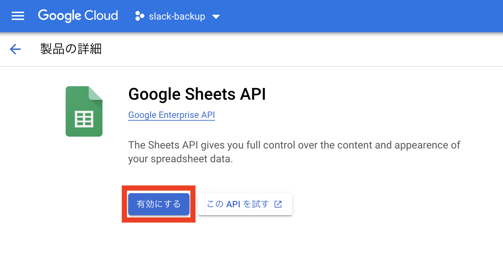
同様に、Google Drive APIを有効にする。
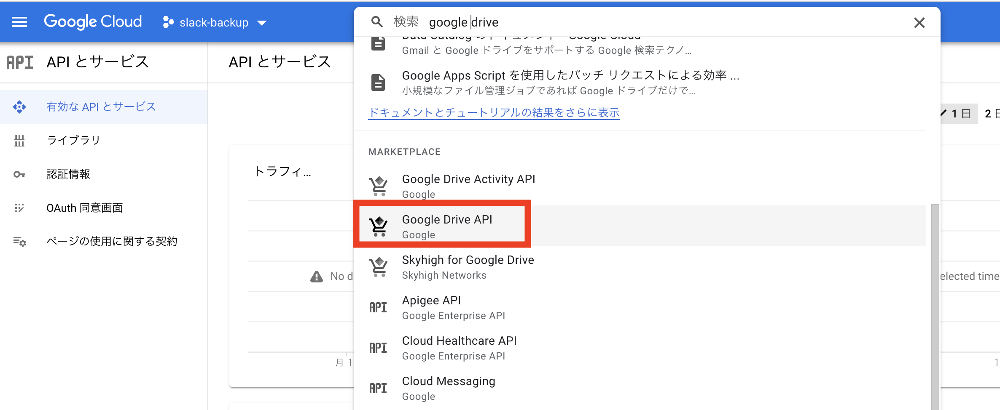
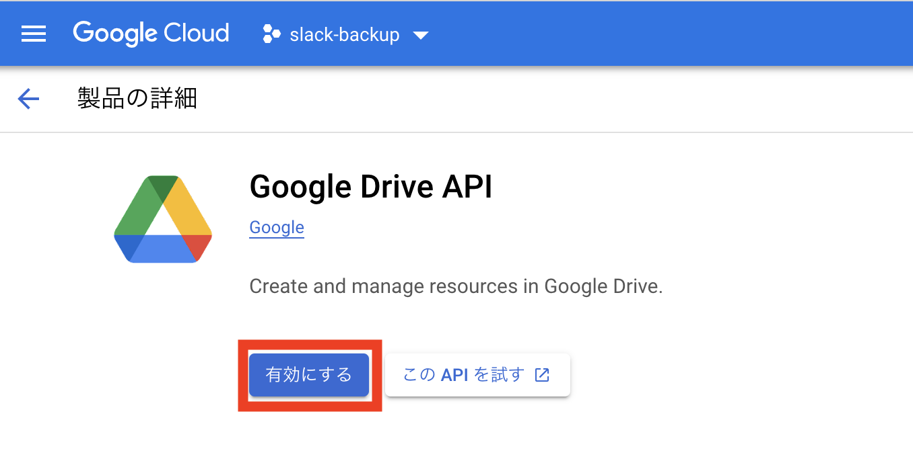
`認証情報を作成` をクリック。
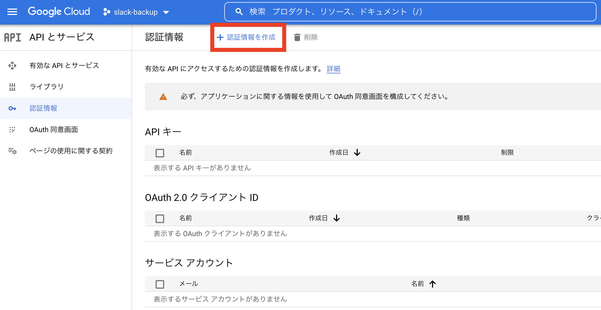
`サービスアカウント` を選択。
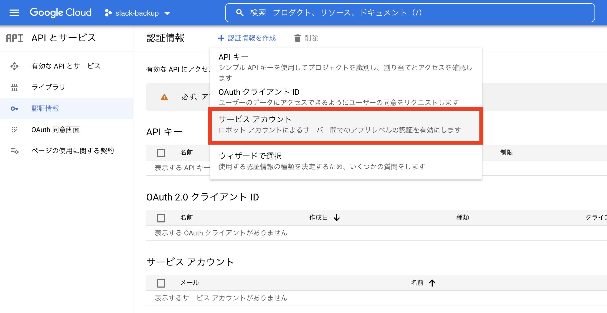
サービスアカウント名を入力し、`完了` を押す。
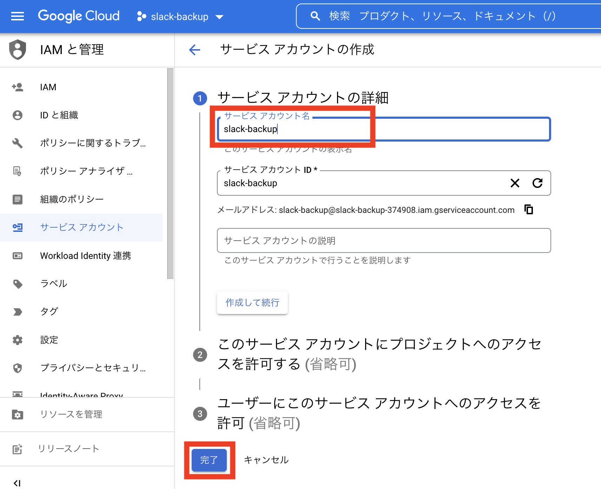
作成したサービスアカウントのメールアドレスを選択。
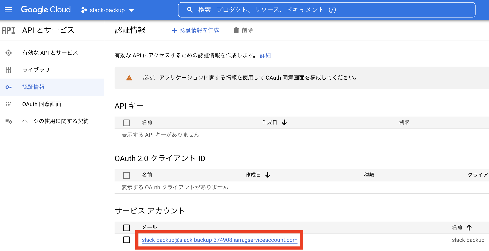
`鍵を追加`
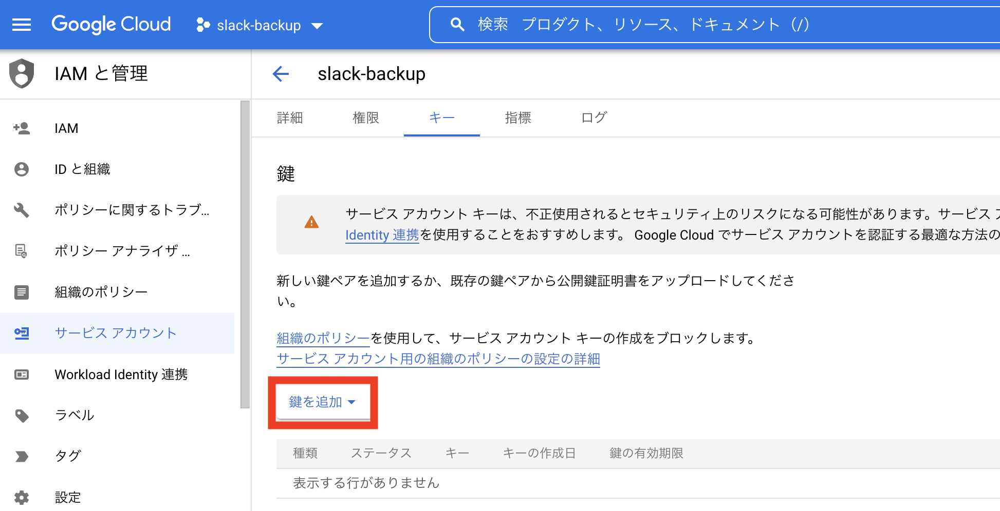
`作成`
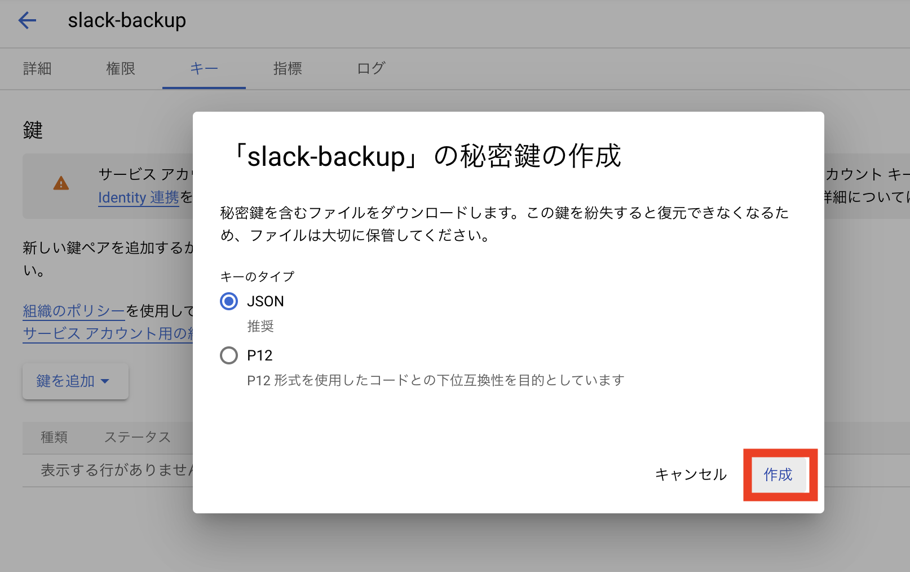
JSONファイルがダウンロードされる。ダウンロードしたJSONファイルを適当なディレクトリに移動しておく。
