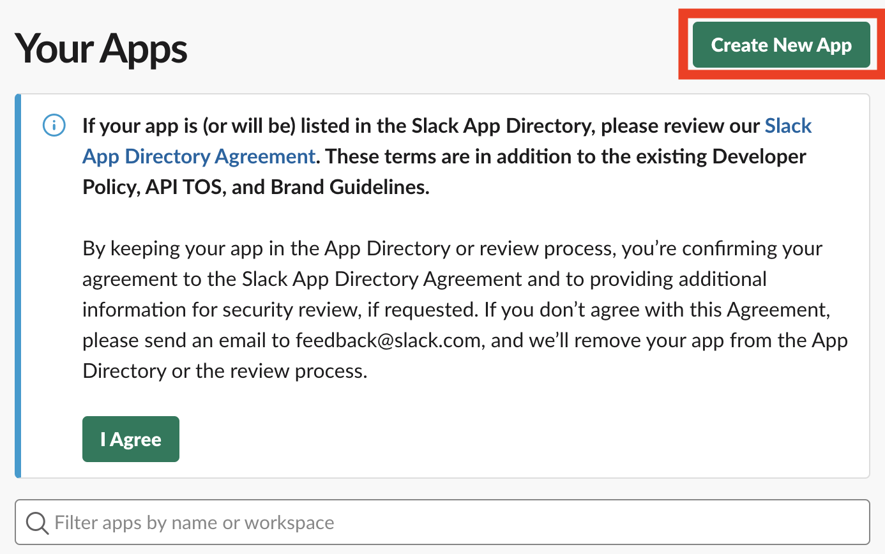
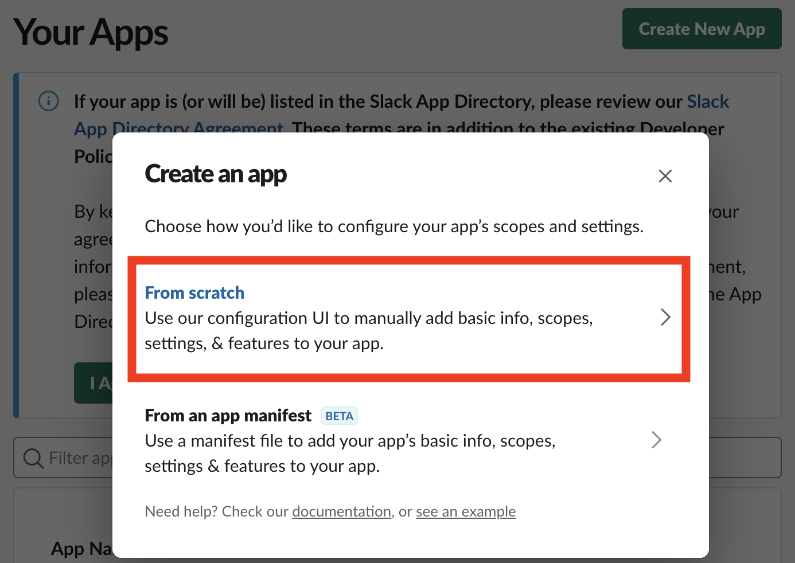
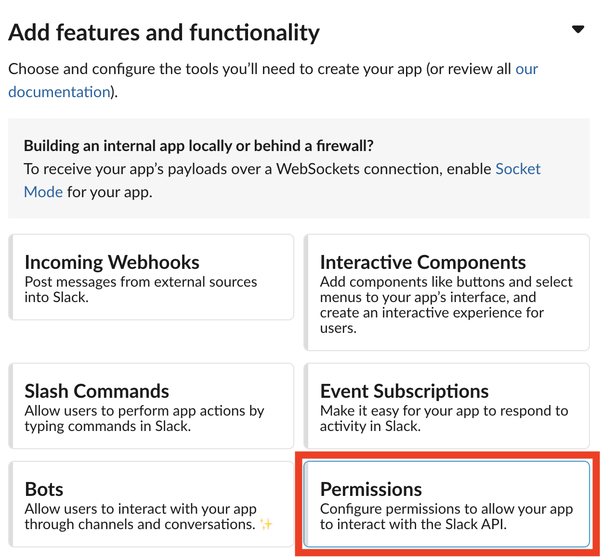
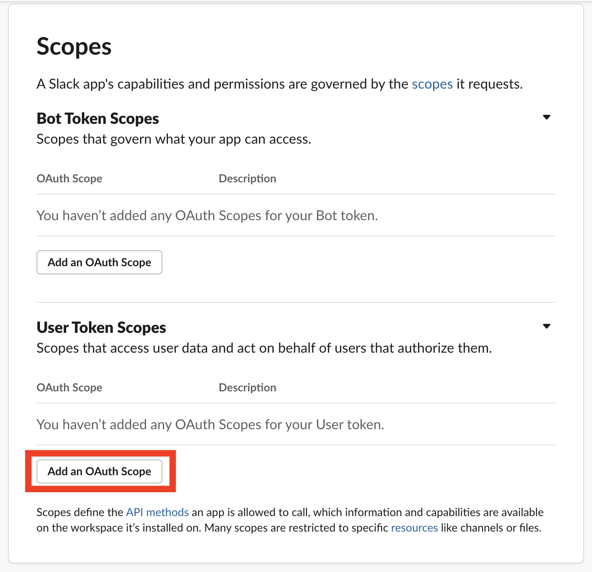
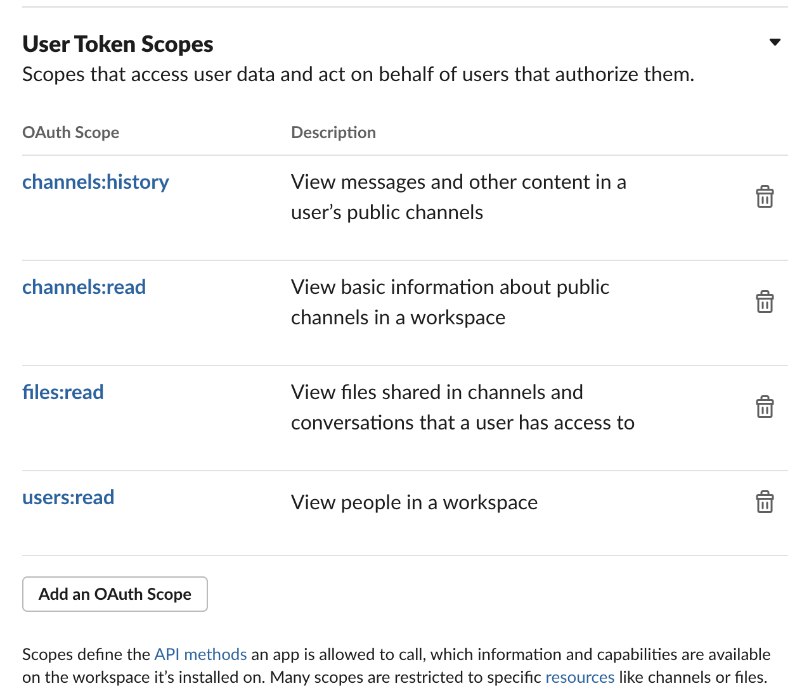
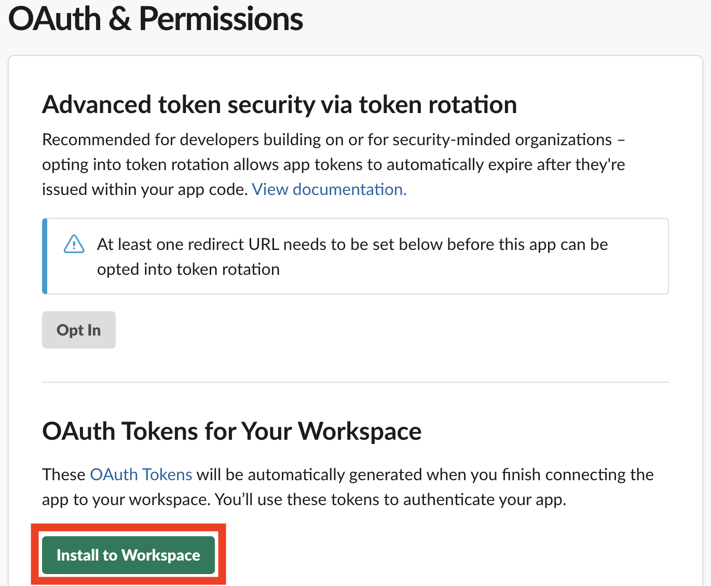
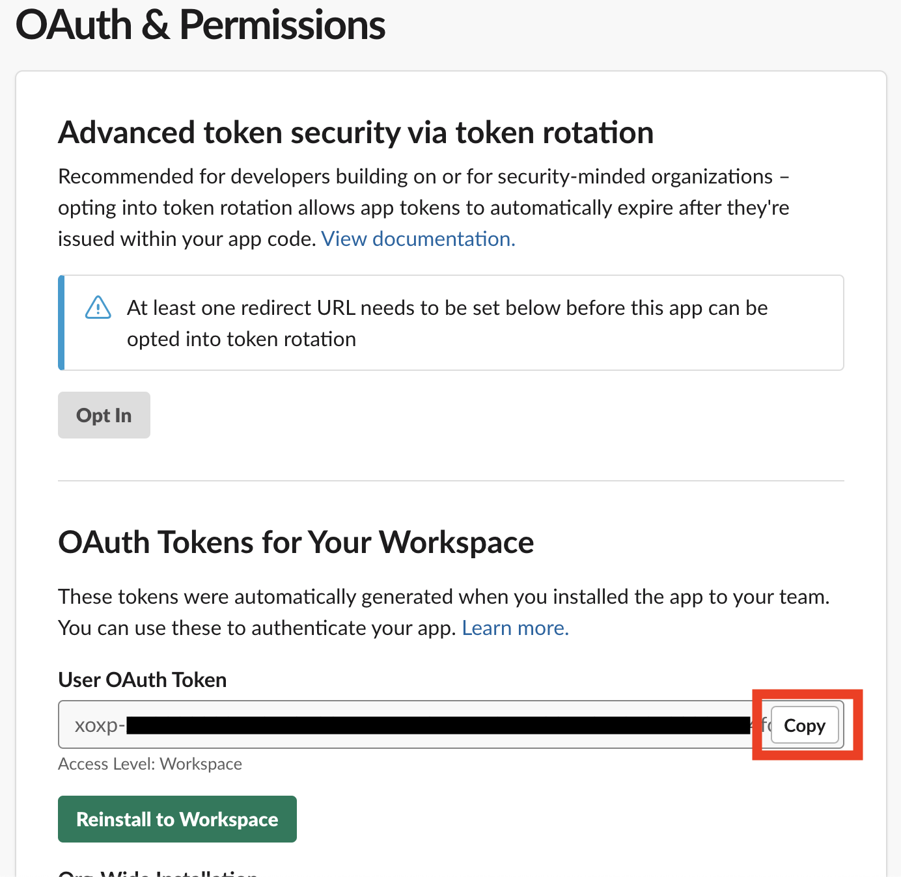

# Slack API tokenの取得方法
- https://api.slack.com/apps から `Create New App`をクリック。

 
- `From scratch` をクリック。

 
- `App Name` を入力。インストールするワークスペースを選択し、`Create App` をクリック。
- `Add features and functionality` の `Permissions` をクリック。

 
- `Scopes` の `User Token Scopes` に以下を追加。
  - `channels:history`
  - `channels:read`
  - `files:read`
  - `users:read`

 
- 下の画像のようになっていればOK

 
- `Install to Workspace` をクリック。

 
- tokenが生成されるのでそれをクリップボードにコピー。

